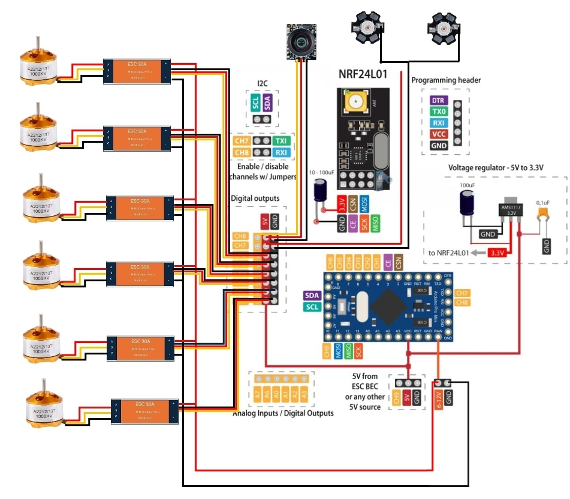

# An-Aquatic-Drone-with-visual-output
An Aquatic landscape type of drone with visual output 
<!DOCTYPE html>
<html lang="en">
<head>
  <meta charset="UTF-8" />
  <meta name="viewport" content="width=device-width, initial-scale=1.0" />
  <title>Aquatic Drone Project</title>
  
</head>
<body>
  <header>
    <h1>Aquatic Drone Project</h1>
    
By Siddivinay Thamaskar

  </header>

  <section>
    <h2>Project Overview</h2>
    
This project aims to design and develop an aquatic drone capable of capturing high-resolution visual data of aquatic landscapes. The drone is equipped with advanced imaging systems to monitor and analyze water bodies, providing valuable insights for environmental monitoring, resource management, and conservation efforts.

    <h2>Key Features</h2>
    <ul>
      <li>High-resolution visual output</li>
      <li>Autonomous navigation in aquatic environments</li>
      <li>Environmental data collection capabilities</li>
    </ul>

    <h2>Project Image</h2>
    

    <h2>Downloads</h2>
    
<a href="Siddivinay_Thamaskar_Resume.pdf" class="btn" download>Download Resume (PDF)</a>

    
<a href="project-report.pdf" class="btn" download>Download Project Report (PDF)</a>

    <h2>Contact</h2>
    
<strong>Email:</strong> siddivinay3101@gmail.com

    
<strong>Phone:</strong> 8801733570

  </section>

  <footer>
    
&copy; 2025 Siddivinay Thamaskar | All rights reserved.

  </footer>
</body>
</html>
